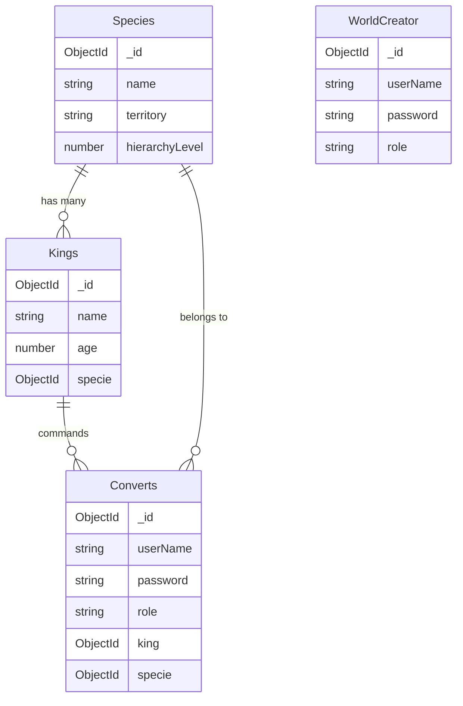

# NightWorld API

API REST construida con **Node.js**, **Express** y **MongoDB (Mongoose)** para la gestión de razas, líderes (reyes alfa) y convertidos dentro de un mundo oscuro de criaturas como vampiros, hombres lobo y necrófagos.

Permite crear, leer, actualizar y eliminar entidades, con un sistema de **roles y autenticación mediante JWT**, donde los líderes pueden crear y administrar convertidos dentro de su misma especie.  
Incluye también el rol supremo **worldCreator**, capaz de alterar cualquier colección o registro.

---

## Instalación y uso

1. Clona el repositorio:

   ```bash
   git clone https://github.com/AleixSu/Project07.API_REST_AUTH.git
   ```

2. Accede al directorio del proyecto:

   ```bash
   cd Project07.API_REST_AUTH
   ```

3. Instala dependencias:

   ```bash
   npm install
   ```

4. Configura las variables de entorno en un archivo `.env`:

   ```env
   DB_URL=mongodb+srv://<USER>:<PASSWORD>@cluster.mongodb.net/nightworldDB
   JWT_SECRET=supersecretkey
   PORT=3000
   ```

5. Inicia el servidor:
   ```bash
   npm run dev
   ```
   Por defecto la API corre en:  
   `http://localhost:3000/api/v1`

---

## Endpoints disponibles

### Species

Base: `/api/v1/species`

| Método | Endpoint | Descripción                      | Acceso                       |
| ------ | -------- | -------------------------------- | ----------------------------- |
| GET    | `/`      | Obtiene todas las especies.      | `alphaAdmin`, `worldCreator`  |
| POST   | `/`      | Crea una nueva especie.          | `worldCreator`                |
| PATCH  | `/:id`   | Actualiza una especie existente. | `worldCreator`                |
| DELETE | `/:id`   | Elimina una especie.             | `worldCreator`                |

#### Ejemplo de body para POST

```json
{
  "name": "Vampires",
  "territory": "Eastern Europe",
  "hierarchyLevel": 3
}
```

---

### Kings

Base: `/api/v1/kings`

| Método | Endpoint | Descripción                 | Acceso                      |
| ------ | -------- | --------------------------- | ---------------------------- |
| GET    | `/`      | Obtiene todos los reyes.    | `alphaAdmin`, `worldCreator` |
| POST   | `/`      | Crea un nuevo rey.          | `worldCreator`               |
| PATCH  | `/:id`   | Actualiza un rey existente. | `worldCreator`               |
| DELETE | `/:id`   | Elimina un rey.             | `worldCreator`               |

#### Ejemplo de body para POST

```json
{
  "name": "Fenrir Odinson",
  "age": 950,
  "specie": "ObjectId('66d7ee0786b5936851d7cf22')"
}
```

---

### Converts

Base: `/api/v1/converts`

| Método | Endpoint            | Descripción                                                                     | Acceso                                       |
| ------ | ------------------- | ------------------------------------------------------------------------------- | -------------------------------------------- |
| GET    | `/`                 | Obtiene todos los convertidos (populate con especie y rey).                     | `alphaAdmin`, `worldCreator`                 |
| GET    | `/kingArmy/:king`   | Obtiene todos los convertidos pertenecientes a un rey.                          | `alphaAdmin`, `worldCreator`, `convertedUser`|
| GET    | `/:id`              | Obtiene un convertido por su ID.                                                | Propietario, `alphaAdmin`, `worldCreator`    |
| POST   | `/register`         | Crea un nuevo convertido (solo usuarios autenticados).                          | `convertedUser`, `alphaAdmin`, `worldCreator`|
| POST   | `/register/byAdmin` | Crea un nuevo convertido (solo administradores).                                | `alphaAdmin`, `worldCreator`                 |
| POST   | `/login`            | Inicia sesión y devuelve el token JWT.                                          | Libre                                        |
| PATCH  | `/:id`              | Actualiza datos de un convertido (el propio usuario o un admin pueden hacerlo). | Propietario, `alphaAdmin`, `worldCreator`    |
| DELETE | `/:id`              | Elimina un usuario (el propio convertido o un admin pueden hacerlo).            | Propietario, `alphaAdmin`, `worldCreator`    |

#### Ejemplo de body para registro

```json
{
  "userName": "lilith",
  "password": "darkmoon"
}
```

---

### WorldCreator

Base: `/api/v1/worldCreators`

| Método | Endpoint | Descripción                            | Acceso         |
| ------ | -------- | -------------------------------------- | --------------- |
| GET    | `/`      | Obtiene los perfiles worldCreator.     | `worldCreator` |
| POST   | `/login` | Inicia sesión y genera token JWT.      | Libre          |

#### Ejemplo de body para login

```json
{
  "userName": "Aetherion",
  "password": "GenesisCore123"
}
```

---

## Roles y Autenticación

- **convertedUser** → Puede crear nuevos usuarios de su misma especie.  
- **alphaAdmin** → Puede crear, modificar o eliminar cualquier usuario.  
- **worldCreator** → Rol supremo, puede alterar cualquier colección o entidad.

Los tokens JWT se generan al iniciar sesión y deben incluirse en el header:

```
Authorization: Bearer <token>
```

---

## Tecnologías usadas

- Node.js + Express  
- MongoDB + Mongoose  
- bcrypt  
- dotenv  
- jsonwebtoken  
- nodemon (dev)

---

## Relaciones entre colecciones



---

## Manejo de rutas no especificadas

El servidor maneja rutas inexistentes con un middleware global que devuelve un 404:

```js
app.use('*', (req, res) => {
  res.status(404).json({ error: 'Route not found' })
})
```

---

## Testing con Postman / Insomnia

1. Inicia el servidor con `npm run dev`.  
2. Registra un `worldCreator` directamente desde el seed.  
3. Usa su token para crear especies, reyes y primeros convertidos.  
4. Valida permisos entre roles con distintos tokens.
